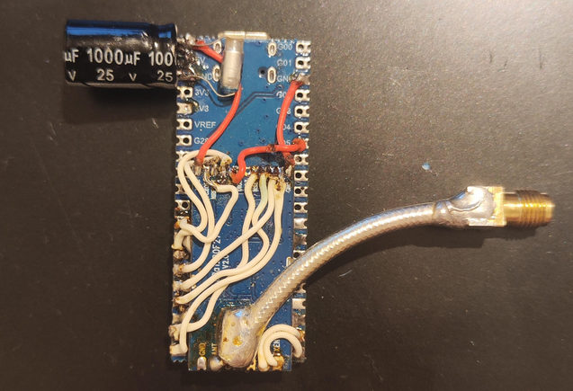
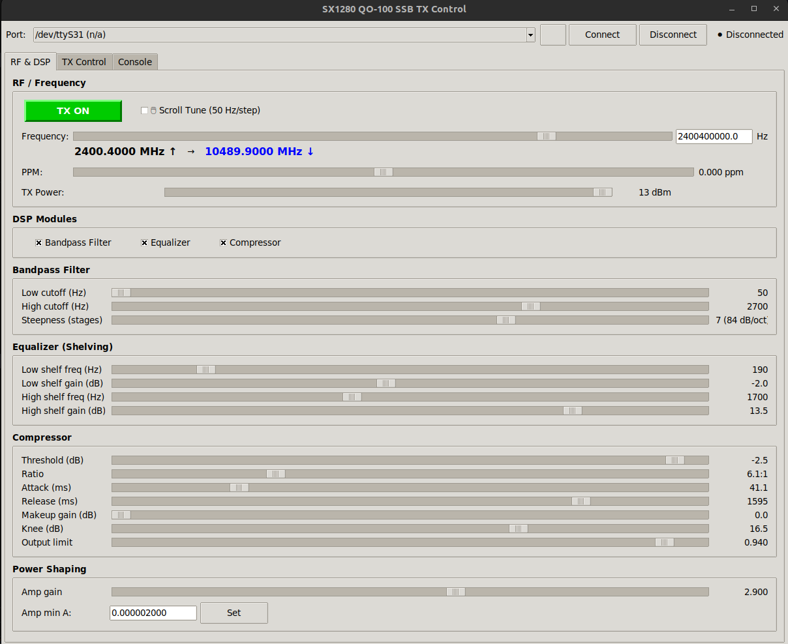

# SX1280 QO-100 SSB TX

**Experimental SSB/Digital transmitter for QO-100 satellite based on SX1280 module (2.4 GHz)**

[](https://creativecommons.org/licenses/by-nc/4.0/)

## Demo

📺 **Video test:** [YouTube Short - SSB TX Test](https://www.youtube.com/shorts/xTy9VHoNrlg)


*SSB signal on QO-100 waterfall (with external amplifier)*

## Project Description

SSB (Single Sideband) and digital modes transmitter for the 2.4 GHz band, designed for communication via the narrowband transponder of the geostationary satellite **QO-100 (Es'hail 2)**.

### Features

- **USB Audio** - Pico acts as USB sound card, audio input directly from computer
- **Output power up to +27 dBm** - Built-in PA in LoRa1280F27 module
- **Real-time DSP** - Bandpass filter, equalizer, compressor
- **USB CDC configuration** - Serial port for parameter control
- **PPM correction** - Precise frequency tuning
- **Carrier mode** - Automatic CW when USB disconnected (after 10s)

## Author

**Kacper Kidała SP8ESA**

Code generated with assistance from **Claude Opus 4.5** and **GPT 5.2**.

## Hardware

### Required Components

| Component | Description |
|-----------|-------------|
| Raspberry Pi Pico 2 | RP2350 microcontroller |
| LoRa1280F27-TCXO | SX1280 module with PA (+27 dBm) and TCXO |
| 2.4 GHz Antenna | SMA or u.FL connector |

### Prototype


*Prototype transmitter used for QO-100 tests - quick and dirty but it works!*

## Wiring Diagram

```
Raspberry Pi Pico 2          LoRa1280F27-TCXO Module
===================          =======================
GPIO 16 (SPI0 RX)  ───────── MISO
GPIO 17            ───────── NSS (CS)
GPIO 18 (SPI0 SCK) ───────── SCK
GPIO 19 (SPI0 TX)  ───────── MOSI
GPIO 20            ───────── RESET
GPIO 21            ───────── BUSY
GPIO 22            ───────── TCXO_EN
GPIO 14            ───────── RX_EN
GPIO 15            ───────── TX_EN

VBUS (5V)          ───────── VCC
GND                ───────── GND

USB                ───────── To computer (Audio + CDC)
```

### IMPORTANT - TCXO Module

The LoRa1280F27-TCXO module requires **TCXO_EN to be HIGH BEFORE SX1280 reset**!

## Building

### Requirements
- [Raspberry Pi Pico SDK](https://github.com/raspberrypi/pico-sdk) 2.0+ (or use VS Code Pico Extension)
- CMake 3.13+
- ARM GCC toolchain

### Clone with submodules
```bash
git clone --recurse-submodules https://github.com/SP8ESA/SX1280_QO100_SSB_TX.git
cd SX1280_QO100_SSB_TX
```

Or if already cloned:
```bash
git submodule update --init
```

### Build
```bash
mkdir build && cd build
cmake ..
make -j4
```

### Flash
```bash
# Hold BOOTSEL and connect USB
cp SX1280SDR.uf2 /media/$USER/RPI-RP2/
```

## Usage

### USB Audio
1. Connect Pico to computer
2. Select "SX1280 QO-100 SSB TX" as audio output device
3. Transmit using any software (SDR, WSJT-X, fldigi, etc.)

### GUI Control Panel


*Python GUI for real-time control of all TX parameters*

Run the GUI:
```bash
python3 gui.py
```

### Carrier Mode
If USB is not connected within 10 seconds of startup, the device automatically starts CW transmission on 2400.300 MHz at full power.

## CDC Commands

After connecting USB, a serial port is available with the following commands:

### Basic Commands

| Command | Description |
|---------|-------------|
| `help` | List commands |
| `get` | Show current configuration |
| `diag` | SX1280 and buffer diagnostics |
| `tx 0/1` | Enable/disable TX (SSB modulation) |
| `cw` | Start CW test |
| `stop` | Stop CW transmission |

### Frequency Configuration

| Command | Description |
|---------|-------------|
| `freq <Hz>` | Set frequency with sub-Hz precision (e.g. `freq 2400100050.5`) |
| `ppm <value>` | Oscillator PPM correction (e.g. `ppm -0.5`) |

**Note:** Frequency is automatically split into PLL steps (~198 Hz resolution) plus fine DSP offset for sub-Hz precision.

### DSP Block Enable/Disable

| Command | Description |
|---------|-------------|
| `enable bp 0/1` | Enable/disable bandpass filter |
| `enable eq 0/1` | Enable/disable equalizer |
| `enable comp 0/1` | Enable/disable compressor |

### Bandpass Filter Settings

| Command | Description |
|---------|-------------|
| `set bp_lo <Hz>` | Lower filter frequency (default 200 Hz) |
| `set bp_hi <Hz>` | Upper filter frequency (default 2700 Hz) |
| `set bp_stages <1-10>` | Filter steepness (12 dB/oct per stage) |

### Equalizer Settings

| Command | Description |
|---------|-------------|
| `set eq_low_hz <Hz>` | Low shelf frequency |
| `set eq_low_db <dB>` | Low shelf gain |
| `set eq_high_hz <Hz>` | High shelf frequency |
| `set eq_high_db <dB>` | High shelf gain |

### Compressor Settings

| Command | Description |
|---------|-------------|
| `set comp_thr <dB>` | Compressor threshold |
| `set comp_ratio <n>` | Compression ratio |
| `set comp_att <ms>` | Attack time |
| `set comp_rel <ms>` | Release time |
| `set comp_makeup <dB>` | Makeup gain |
| `set comp_knee <dB>` | Knee width |
| `set comp_outlim <0..1>` | Output limiter |

### Amplifier Settings

| Command | Description |
|---------|-------------|
| `set amp_gain <float>` | Final gain |
| `set amp_min_a <float>` | Minimum amplitude |

### Additional Commands

| Command | Description |
|---------|-------------|
| `txpwr <-18..13>` | Max TX power on SX1280 chip in dBm |

## Technical Specifications

| Parameter | Value |
|-----------|-------|
| Frequency range | 2400.000 - 2400.500 MHz |
| Output power | up to +27 dBm |
| Modulation | SSB (USB), CW |
| Audio sample rate | 48 kHz (USB) → 8 kHz (DSP) |
| TCXO stability | ±0.5 ppm |

## QO-100 Uplink

QO-100 Narrowband Transponder:
- **Uplink:** 2400.000 - 2400.500 MHz
- **Downlink:** 10489.500 - 10490.000 MHz

## Changelog

### v1.5.0
- **New feature:** Sub-Hz frequency precision via automatic PLL + DSP fine tuning
  - Frequency stored as double - no more 198 Hz PLL quantization visible to user
  - Firmware automatically splits frequency into PLL steps + DSP complex carrier rotation
- **GUI improvements:**
  - **TX ON/OFF button** with green color when transmitting
  - **PPM slider** (-2 to +2 ppm) with immediate response
  - **Scroll wheel tuning** (50 Hz per step, toggleable checkbox)
  - **QO-100 downlink frequency** display (uplink → downlink conversion)
  - All sliders now respond immediately (no delay)
- Added `tx 0/1` command for TX enable/disable
- **Updated default DSP values** (optimized for voice):
  - Bandpass: 50-2700 Hz
  - EQ low shelf: -2.0 dB (was -9.5)
  - Compressor threshold: -2.5 dB (was -12.5)
  - Output limit: 0.940 (was 0.312)
  - Amp gain: 2.9 (was 4.36)

### v1.4.1
- **CRITICAL FIX:** Fixed NaN bug in shelf filter that caused continuous carrier instead of SSB modulation
- **CRITICAL FIX:** Reverted unstable DSP parameter changes from v1.4.0 that caused distorted audio
- Removed experimental features (timing jitter, EQ slope) that caused instability
- Restored proven default DSP values from v1.3.0
- Kept only stable new features: TX power control (`txpwr`) and BP stages (`bp_stages`)
- GUI updated to match firmware capabilities

### v1.4.0 (DEPRECATED - DO NOT USE)
- ⚠️ This version has critical bugs causing continuous carrier and distorted audio
- Added adjustable bandpass filter stages (`set bp_stages 1-10`)
- Added EQ slope parameter (removed in v1.4.1)
- Added timing jitter dithering (removed in v1.4.1)
- Added TX power control (`txpwr -18..13`)

### v1.3.0
- DSP chain reordered: EQ → Compressor → BPF
- Added Python GUI for CDC control

### v1.2.0
- Fixed USB Audio compatibility on Windows
- Added volume control support

### v1.1.0
- Initial release with basic SSB TX functionality

## TODO

- [ ] Add preset system for saving/loading configurations
- [ ] Add spectrum analyzer display in GUI

## Warning

**Transmission on 2.4 GHz requires appropriate radio license!**

Make sure you have a valid amateur radio license and comply with regulations in your country.

## License

This project is licensed under **CC BY-NC 4.0** (Creative Commons Attribution-NonCommercial).

- Non-commercial use (including amateur radio) - OK
- Modifications allowed - OK
- Commercial use requires author's permission

This project uses:
- [TinyUSB](https://github.com/hathach/tinyusb) - MIT License
- [Raspberry Pi Pico SDK](https://github.com/raspberrypi/pico-sdk) - BSD-3-Clause

---

73 de SP8ESA
