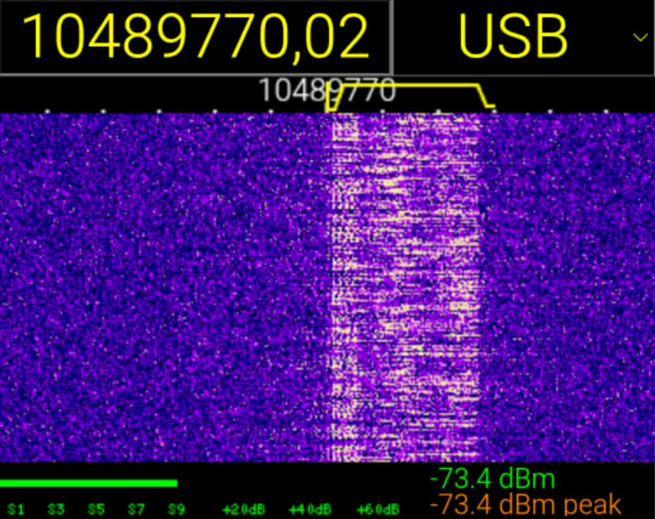
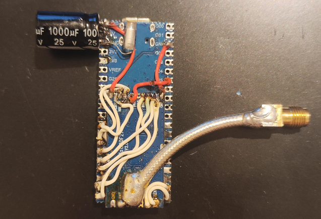
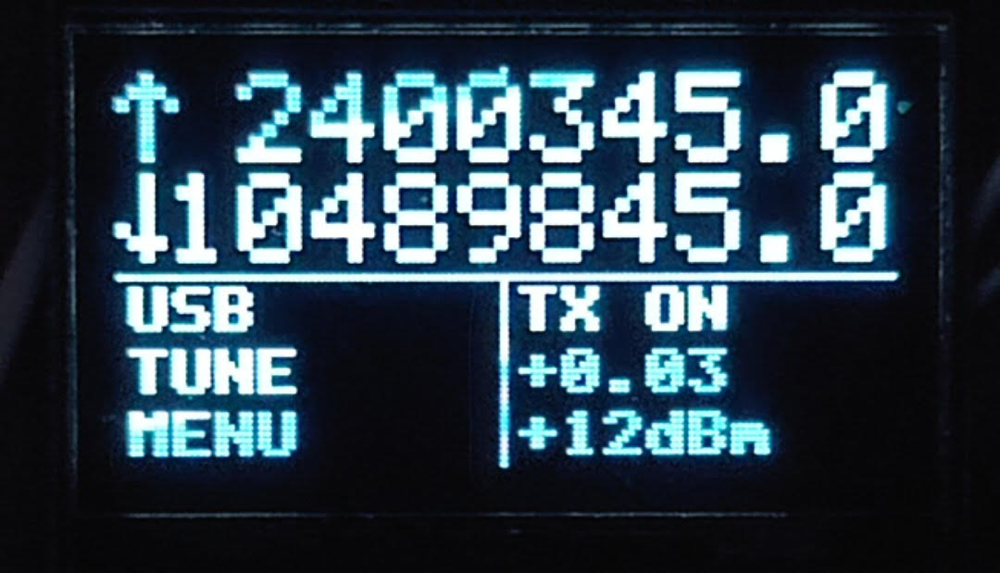
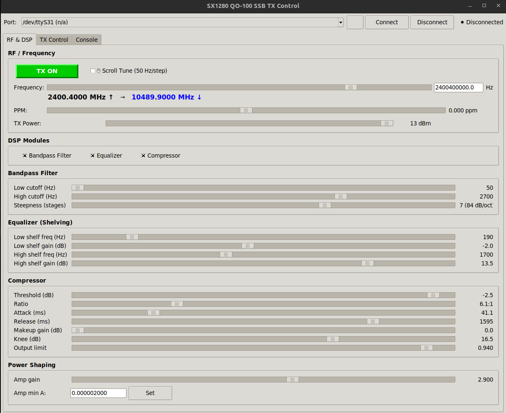

# SX1280 QO-100 SSB TX

**SSB/CW/FM transmitter for QO-100 satellite (Es'hail 2) and 2.4 GHz band with SX1280 + Raspberry Pi Pico 2**

[](https://creativecommons.org/licenses/by-nc/4.0/)

## Demo

📺 **Video test:** [YouTube Short - SSB TX Test](https://www.youtube.com/shorts/xTy9VHoNrlg)


*SSB signal on QO-100 waterfall (with external amplifier)*

## Project Description

SSB (Single Sideband), CW and FM transmitter for the 2.4 GHz band, designed for communication via the narrowband transponder of the geostationary satellite **QO-100 (Es'hail 2)** and general 2.4 GHz amateur operation.

> **⚠️ WARNING: DO NOT transmit FM on the QO-100 narrowband transponder!**
> The QO-100 NB transponder is for SSB/CW only. FM transmission will cause interference and is prohibited. Use FM mode only on appropriate amateur frequencies outside QO-100.

The system uses a **dual-core architecture** — Core0 handles USB audio input and real-time DSP processing, while Core1 handles Hilbert transform, I/Q modulation and SX1280 SPI transmission at 8 kHz rate.

### Features

- **USB Audio** — Pico acts as USB sound card, audio input directly from computer
- **Microphone input (ADC)** — MAX4466 electret module on ADC0, standalone TX without computer
- **Audio source switching** — PC (USB) or MIC (ADC) selectable via encoder menu or GUI
- **MIC DSP** — Hardware timer ISR at 8 kHz, DC removal, AGC with noise gate
- **Real-time DSP** — Bandpass filter, equalizer, compressor, power shaping
- **FM mode** — Direct frequency modulation with adjustable deviation (200 Hz – 100 kHz) and CTCSS tones (**⚠️ NOT for QO-100!**)
- **Full Band operation** — Extended frequency range 2300–2500 MHz (QO-100 range + general 2.4 GHz)
- **Sub-Hz frequency precision** — Automatic PLL + DSP fine tuning (no 198 Hz quantization)
- **OLED display (SSD1306)** — Real-time status: frequency, mode, TX state, audio source, parameters
- **Rotary encoder + buttons** — Standalone operation without computer
- **PTT** — Push-to-talk for SSB mode (GPIO5), OR with GUI TX enable
- **CW keying** — Iambic-style keying with PTT/KEY button
- **Python GUI** — Full control panel over CDC serial with live synchronization
- **Output power up to +27 dBm** — Built-in PA in LoRa1280F27 module
- **PPM correction** — Precise frequency calibration
- **Powerbank operation** — Auto-detects missing USB host, switches to MIC input

## Author

**Kacper Kidała SP8ESA**

Code generated with assistance from **Claude Opus 4** and **GPT 5.2**.

## Hardware

### Required Components

| Component | Description |
|-----------|-------------|
| Raspberry Pi Pico 2 | RP2350 microcontroller (dual Cortex-M33) |
| LoRa1280F27-TCXO | SX1280 module with PA (+27 dBm) and TCXO |
| MAX4466 microphone module | Electret mic with amplifier (3.3V powered) |
| SSD1306 OLED 128×64 | I2C display (0.96") |
| Rotary encoder with push button | KY-040 or similar (3-pin + SW) |
| PTT / CW key button | Momentary pushbutton (normally open) |
| 2.4 GHz Antenna | SMA or u.FL connector |

### Prototype


*Prototype transmitter used for QO-100 tests — quick and dirty but it works!*

### OLED Display


*SSD1306 OLED showing frequency, mode, TX state and current parameter*

## Architecture

```
Core0 (USB + DSP Producer)            Core1 (Radio Consumer)
┌──────────────────────────┐          ┌──────────────────────────┐
│ USB Audio @ 48kHz        │          │ Timer IRQ @ 8kHz         │
│   or MIC ADC @ 8kHz      │          │ Read from block buffer   │
│ Downsample 48k → 8k     │          │ Hilbert transform        │
│ DSP: BP → EQ → Comp     │ ───────► │ I/Q modulation           │
│ MIC: AGC + noise gate    │          │ SX1280 SPI TX            │
│ Write to block buffer    │          │                          │
│ Encoder / button poll    │          │ CW carrier (TUNE mode)   │
│ OLED refresh via DMA     │          │                          │
│ CDC command handler      │          │                          │
│ Status push to GUI       │          │                          │
└──────────────────────────┘          └──────────────────────────┘
```

## Wiring Diagram

See [WIRING.txt](WIRING.txt) for detailed visual diagrams.

```
Raspberry Pi Pico 2          LoRa1280F27-TCXO Module
===================          =======================
GPIO 16 (SPI0 RX)  ───────── MISO
GPIO 17            ───────── NSS (CS)
GPIO 18 (SPI0 SCK) ───────── SCK
GPIO 19 (SPI0 TX)  ───────── MOSI
GPIO 20            ───────── RESET
GPIO 21            ───────── BUSY
GPIO 22            ───────── TCXO_EN
GPIO 14            ───────── RX_EN
GPIO 15            ───────── TX_EN

SSD1306 OLED (I2C1)          Encoder + Buttons
================             ==================
GPIO 6  (I2C1 SDA) ── SDA   GPIO 2  ── Encoder A
GPIO 7  (I2C1 SCL) ── SCL   GPIO 3  ── Encoder B
3V3                 ── VCC   GPIO 4  ── Encoder push (SW)
GND                 ── GND   GPIO 5  ── PTT / CW key

MAX4466 Microphone
==================
GPIO 26 (ADC0)      ── OUT
3V3                 ── VCC
GND                 ── GND

VBUS (5V)          ───────── VCC (LoRa module)
GND                ───────── GND
USB                ───────── To computer (Audio + CDC)
```

All encoder/button inputs use internal pull-ups (active LOW).

### IMPORTANT - TCXO Module

The LoRa1280F27-TCXO module requires **TCXO_EN to be HIGH BEFORE SX1280 reset**!

## Building

### Requirements
- [Raspberry Pi Pico SDK](https://github.com/raspberrypi/pico-sdk) 2.0+ (or use VS Code Pico Extension)
- CMake 3.13+
- ARM GCC toolchain

### Clone with submodules
```bash
git clone --recurse-submodules https://github.com/SP8ESA/SX1280_QO100_SSB_TX.git
cd SX1280_QO100_SSB_TX
```

Or if already cloned:
```bash
git submodule update --init
```

### Build
```bash
mkdir build && cd build
cmake ..
make -j4
```

### Flash
```bash
# Hold BOOTSEL and connect USB
cp SX1280SDR.uf2 /media/$USER/RPI-RP2/
```

## Usage

### USB Audio
1. Connect Pico to computer
2. Select "SX1280 QO-100 SSB TX" as audio output device
3. Transmit using any software (SDR, WSJT-X, fldigi, etc.)

### GUI Control Panel


*Python GUI for real-time control of all TX parameters*

Run the GUI:
```bash
pip install pyserial
python3 gui.py
```

Features:
- **Live synchronization** — GUI updates in real-time when encoder/buttons change parameters on hardware
- **RF & DSP tab** — Frequency (0.1 kHz precision), PPM, TX power, bandpass, EQ, compressor, power shaping
- **Console tab** — Serial log, manual CDC commands
- Auto-detection of SX1280 USB device

### Standalone Operation

The device operates fully without a computer using the MAX4466 microphone:
- Rotary encoder adjusts frequency (±100 Hz per step)
- Short press toggles TUNE carrier
- Long press enters parameter edit mode (browse with encoder, press to select)
- Audio source selectable: PC (USB) or MIC (ADC) via parameter menu
- PTT/KEY button for CW keying or SSB push-to-talk
- OLED shows all status in real-time
- Powered from USB powerbank — auto-switches to MIC input if no USB host detected within 3 seconds

### Carrier Mode
If USB is not connected within 10 seconds of startup, the device automatically starts CW transmission on 2400.300 MHz at full power.

## CDC Commands

After connecting USB, a serial port is available with the following commands:

### Basic Commands

| Command | Description |
|---------|-------------|
| `help` | List commands |
| `get` | Show current configuration |
| `status` | Force status push to GUI (`!S` line) |
| `diag` | SX1280 and buffer diagnostics |
| `tx 0/1` | Enable/disable TX (SSB modulation) |
| `mode usb/cw/fm` | Set modulation mode (**⚠️ FM NOT for QO-100!**) |
| `tune 0/1` | Toggle TUNE carrier |
| `cw` | Start CW test |
| `stop` | Stop CW transmission |

### Frequency Configuration

| Command | Description |
|---------|-------------|
| `freq <Hz>` | Set frequency with sub-Hz precision (e.g. `freq 2400100050.5`) |
| `ppm <value>` | Oscillator PPM correction (e.g. `ppm -0.5`) |

**Note:** Frequency is automatically split into PLL steps (~198 Hz resolution) plus fine DSP offset for sub-Hz precision.

### DSP Block Enable/Disable

| Command | Description |
|---------|-------------|
| `enable bp 0/1` | Enable/disable bandpass filter |
| `enable eq 0/1` | Enable/disable equalizer |
| `enable comp 0/1` | Enable/disable compressor |

### Bandpass Filter Settings

| Command | Description |
|---------|-------------|
| `set bp_lo <Hz>` | Lower filter frequency (default 200 Hz) |
| `set bp_hi <Hz>` | Upper filter frequency (default 2700 Hz) |
| `set bp_stages <1-10>` | Filter steepness (12 dB/oct per stage) |

### Equalizer Settings

| Command | Description |
|---------|-------------|
| `set eq_low_hz <Hz>` | Low shelf frequency |
| `set eq_low_db <dB>` | Low shelf gain |
| `set eq_high_hz <Hz>` | High shelf frequency |
| `set eq_high_db <dB>` | High shelf gain |

### Compressor Settings

| Command | Description |
|---------|-------------|
| `set comp_thr <dB>` | Compressor threshold |
| `set comp_ratio <n>` | Compression ratio |
| `set comp_att <ms>` | Attack time |
| `set comp_rel <ms>` | Release time |
| `set comp_makeup <dB>` | Makeup gain |
| `set comp_knee <dB>` | Knee width |
| `set comp_outlim <0..1>` | Output limiter |

### Amplifier Settings

| Command | Description |
|---------|-------------|
| `set amp_gain <float>` | Final gain |
| `set amp_min_a <float>` | Minimum amplitude |

### Additional Commands

| Command | Description |
|---------|-------------|
| `txpwr <-18..13>` | Max TX power on SX1280 chip in dBm |

### Audio Source & Microphone AGC

| Command | Description |
|---------|-------------|
| `src pc` | Switch to PC (USB audio) input |
| `src mic` | Switch to MIC (ADC0) input |
| `set mic_agc_target <0..1>` | AGC target level (default 0.75) |
| `set mic_agc_max_gain <1..200>` | AGC maximum gain (default 1.0) |
| `set mic_agc_attack <float>` | AGC attack coefficient (default 0.01) |
| `set mic_agc_release <float>` | AGC release coefficient (default 0.0001) |
| `set mic_gate_thresh <float>` | Noise gate threshold (default 0.005) |

### FM Mode Settings

> **⚠️ FM mode is for general 2.4 GHz amateur use only — DO NOT use FM on QO-100!**

| Command | Description |
|---------|-------------|
| `set fm_dev <200..100000>` | FM deviation in Hz (default 2500, i.e. NBFM ±2.5 kHz) |
| `set ctcss <freq\|0>` | CTCSS sub-audible tone in Hz (0 = off; e.g. `set ctcss 88.5`) |

Standard CTCSS tones from 67.0 to 254.1 Hz are supported. The tone is mixed at ~15% of deviation (standard level).

## Technical Specifications

| Parameter | Value |
|-----------|-------|
| Frequency range | 2300.000 – 2500.000 MHz (QO-100: 2400.000 – 2400.500 MHz) |
| Output power | up to +27 dBm (adjustable -18…+13 dBm on chip) |
| Modulation | SSB (USB), CW, FM (with CTCSS) |
| Audio input | USB 48 kHz (PC) or ADC 8 kHz (MAX4466 microphone) |
| Audio sample rate | 48 kHz (USB) → 8 kHz (DSP); 8 kHz direct (MIC) |
| MIC processing | Hardware timer ISR, DC removal, AGC with noise gate |
| SPI clock | 18 MHz |
| OLED | SSD1306 128×64, I2C1 @ 1 MHz, DMA transfer |
| TCXO stability | ±0.5 ppm |
| Frequency resolution | Sub-Hz (PLL steps + DSP fine offset) |

## QO-100 Uplink

QO-100 Narrowband Transponder:
- **Uplink:** 2400.000 - 2400.500 MHz
- **Downlink:** 10489.500 - 10490.000 MHz

## Changelog

### v2.1.1
- **FM mode** — Direct frequency modulation via PLL, deviation adjustable 200 Hz – 100 kHz (`set fm_dev <Hz>`)
- **CTCSS tones** — 42 standard sub-audible tones (67.0–254.1 Hz), mixed at ~15% deviation level (`set ctcss <freq|0>`)
- **Full Band operation** — Extended frequency range 2300–2500 MHz; GUI "Full Band" checkbox toggles between QO-100 (2400.0–2400.5) and full range
- **GUI FM Settings panel** — Deviation slider + CTCSS combobox with all standard tones
- **GUI Spectrum Analyzer** — Placeholder canvas (real FFT display planned for future release)
- **OLED downlink hidden** — Downlink frequency row hidden when operating outside QO-100 range
- **Encoder 3-way mode cycle** — USB → CW → FM → USB (both directions)
- **Status push extended** — `fm_dev` and `ctcss` fields for GUI synchronization
- **⚠️ WARNING: DO NOT transmit FM on QO-100!** The NB transponder is SSB/CW only.

### v2.1.0
- **Microphone input (ADC)** — MAX4466 electret module on ADC0 (GPIO26), hardware timer ISR at 8 kHz
- **Audio source switching** — PC (USB) or MIC (ADC) via encoder parameter menu, GUI radiobuttons, or `src pc|mic` CDC command
- **MIC AGC with noise gate** — Configurable target level, max gain, attack/release, gate threshold
- **PTT for SSB** — GPIO5 push-to-talk in SSB mode; TX enabled by GUI TX ON *or* PTT press
- **Powerbank operation** — 3s USB host timeout, auto-switch to MIC input; rate-limited USB polling without host
- **OLED stability fix** — Centralized single `oled_poll()` replaces 4 independent render timers; eliminates framebuffer corruption during DMA
- **Default TX OFF** — TX disabled on boot for safety (was enabled in v2.0.0)
- **GUI improvements:**
  - Audio source (PC/MIC) radiobuttons with live sync
  - MIC AGC control panel (5 sliders: target, max gain, attack, release, gate threshold)
  - TX defaults to OFF on connect

### v2.0.0
- **OLED display** — SSD1306 128×64 via I2C1 with DMA (zero CPU during transfer)
- **Rotary encoder** — Frequency tuning (±100 Hz), parameter browsing/editing
- **CW keying** — PTT/KEY button with carrier state machine
- **TUNE mode** — Toggle carrier via encoder push or CDC command
- **GUI live sync** — Firmware pushes `!S` status lines on parameter change; GUI heartbeat ensures sync
- **`status` command** — Force immediate status push for GUI synchronization
- **Frequency formatting fix** — Bypasses newlib-nano scientific notation (`2.4e+09` → `2400000000.0`)
- **GUI improvements:**
  - Frequency entry in kHz with 0.1 kHz precision
  - Removed scroll tune (replaced by hardware encoder)
  - Adaptive polling (10ms when active, 50ms when idle)
  - Status push coalescing — only latest `!S` applied per cycle
  - Error logging for parse failures
- **Reduced status push throttle** from 250ms to 100ms

### v1.5.0
- **New feature:** Sub-Hz frequency precision via automatic PLL + DSP fine tuning
  - Frequency stored as double - no more 198 Hz PLL quantization visible to user
  - Firmware automatically splits frequency into PLL steps + DSP complex carrier rotation
- **GUI improvements:**
  - **TX ON/OFF button** with green color when transmitting
  - **PPM slider** (-2 to +2 ppm) with immediate response
  - **Scroll wheel tuning** (50 Hz per step, toggleable checkbox)
  - **QO-100 downlink frequency** display (uplink → downlink conversion)
  - All sliders now respond immediately (no delay)
- Added `tx 0/1` command for TX enable/disable
- **Updated default DSP values** (optimized for voice):
  - Bandpass: 50-2700 Hz
  - EQ low shelf: -2.0 dB (was -9.5)
  - Compressor threshold: -2.5 dB (was -12.5)
  - Output limit: 0.940 (was 0.312)
  - Amp gain: 2.9 (was 4.36)

### v1.4.1
- **CRITICAL FIX:** Fixed NaN bug in shelf filter that caused continuous carrier instead of SSB modulation
- **CRITICAL FIX:** Reverted unstable DSP parameter changes from v1.4.0 that caused distorted audio
- Removed experimental features (timing jitter, EQ slope) that caused instability
- Restored proven default DSP values from v1.3.0
- Kept only stable new features: TX power control (`txpwr`) and BP stages (`bp_stages`)
- GUI updated to match firmware capabilities

### v1.4.0 (DEPRECATED - DO NOT USE)
- ⚠️ This version has critical bugs causing continuous carrier and distorted audio
- Added adjustable bandpass filter stages (`set bp_stages 1-10`)
- Added EQ slope parameter (removed in v1.4.1)
- Added timing jitter dithering (removed in v1.4.1)
- Added TX power control (`txpwr -18..13`)

### v1.3.0
- DSP chain reordered: EQ → Compressor → BPF
- Added Python GUI for CDC control

### v1.2.0
- Fixed USB Audio compatibility on Windows
- Added volume control support

### v1.1.0
- Initial release with basic SSB TX functionality

## TODO

- [ ] Add preset system for saving/loading configurations
- [ ] Spectrum analyzer — implement real FFT-based display in GUI (placeholder already in place)
- [ ] GPSDO / 10 MHz reference input for improved frequency stability and accuracy
- [ ] VOX (voice-activated TX) for MIC mode

## Warning

**Transmission on 2.4 GHz requires appropriate radio license!**

Make sure you have a valid amateur radio license and comply with regulations in your country.

**⚠️ DO NOT transmit FM on the QO-100 narrowband transponder!** The QO-100 NB transponder is for SSB/CW only. FM transmission will cause interference and is prohibited. Use FM mode only outside the QO-100 transponder passband.

## License

This project is licensed under **CC BY-NC 4.0** (Creative Commons Attribution-NonCommercial).

- Non-commercial use (including amateur radio) - OK
- Modifications allowed - OK
- Commercial use requires author's permission

This project uses:
- [TinyUSB](https://github.com/hathach/tinyusb) - MIT License
- [Raspberry Pi Pico SDK](https://github.com/raspberrypi/pico-sdk) - BSD-3-Clause

---

73 de SP8ESA
